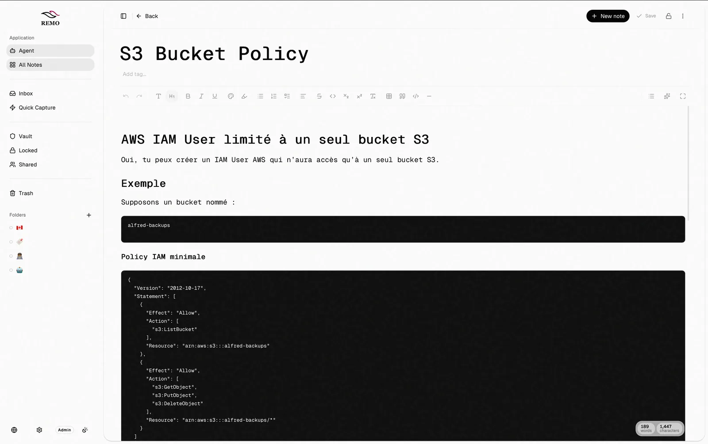
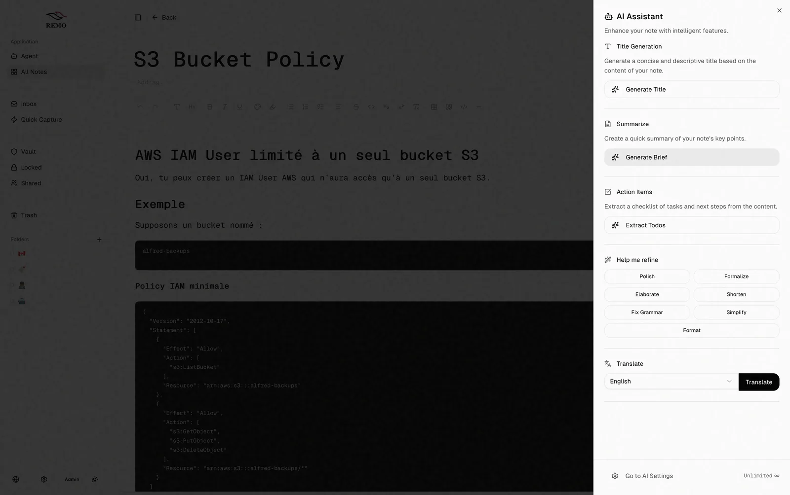
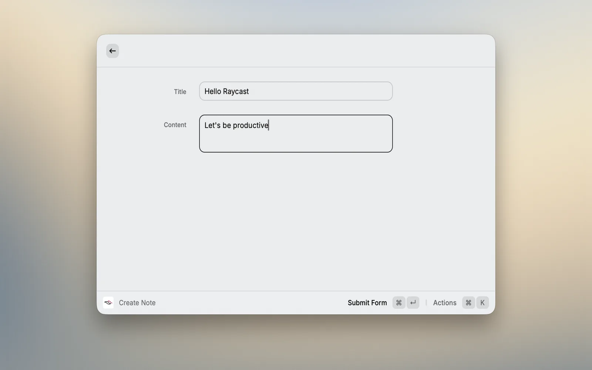
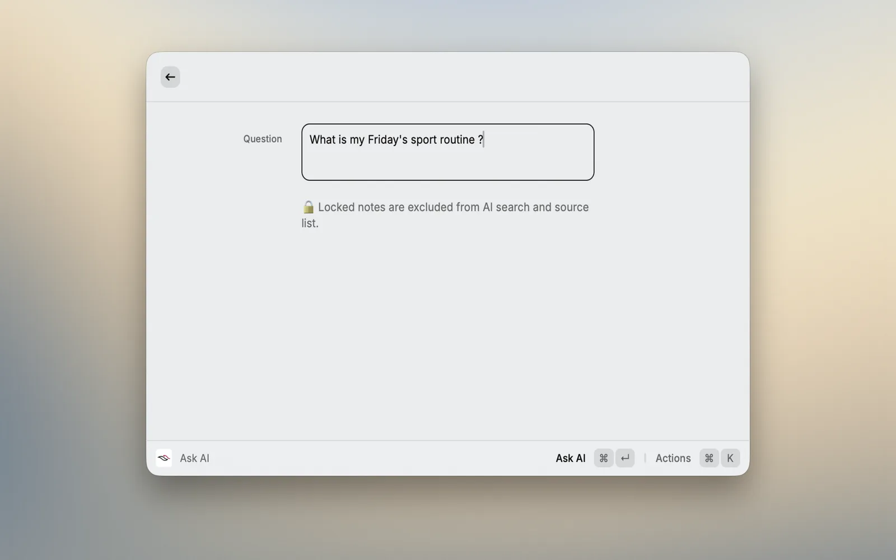

# Remo: note-taking built around your workflow

## The product

I am building **Remo** in public out of frustration with existing tools. Most note apps either lack the depth needed for technical work or feel bloated and slow. Remo aims for a clean balance: simple by default, with powerful tools available when you need them.

The workflow centers on fast capture, frictionless organization, and an AI assistant grounded directly in your own notes.

## Key features

- **Instant capture**: create notes in seconds directly from the Raycast extension without switching windows.
- **Context-aware assistant**: summarize, rewrite, translate, and extract action items through a multi-provider AI engine.
- **Vault & encryption**: protect sensitive notes with passcode locks and optional end-to-end encryption.
- **Real-time sync**: instant updates across devices powered by Convex.
- **Data portability**: straightforward Markdown import and export with shareable web links.
- **Note snapshots**: version history to inspect changes and restore previous drafts.

## AI grounded in your notes

Rather than generic text generation, Remo's assistant queries your existing notes to answer questions, build summaries, and pull out tasks. The AI layer is abstracted behind a multi-provider interface (Anthropic, OpenAI, Gemini, Ollama), making it simple to switch models without modifying product logic.

## Capture & AI from Raycast

The Raycast extension makes Remo accessible anywhere in macOS. You can jot down ideas, search existing notes, or prompt the AI assistant directly from the command bar.

## Architecture & tech stack

Remo runs as a Turborepo and pnpm monorepo uniting three client surfaces with a shared backend:

- **Frontend**: TanStack Start (React 19), Shadcn UI, and Tailwind CSS.
- **Backend & database**: Convex for real-time document synchronization.
- **Authentication**: Clerk.
- **AI integration**: Vercel AI SDK with multi-provider abstraction.
- **Editor core**: Tiptap.
- **Client surfaces**: web application (with PWA offline support), Electron desktop app for macOS and Windows, and a native Raycast extension.

## My role

I handle Remo end to end, including product design, monorepo architecture, client applications, and the AI integration layer. The roadmap is public and shaped by active user feedback.
