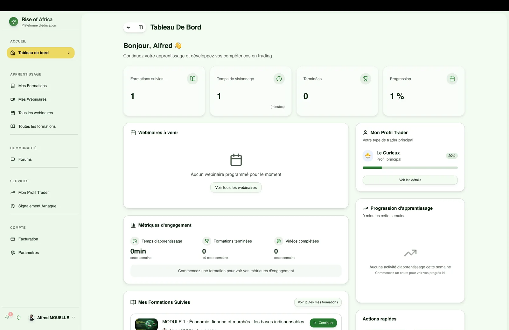
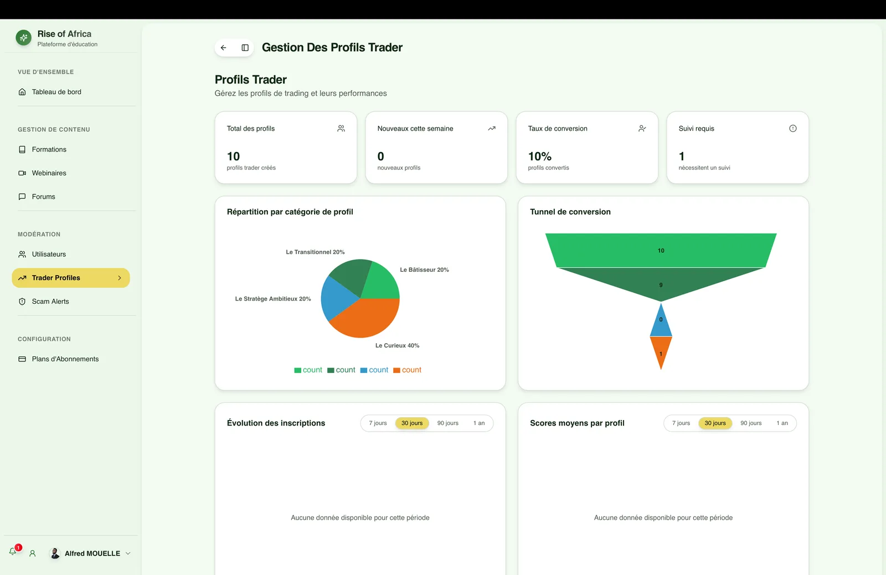
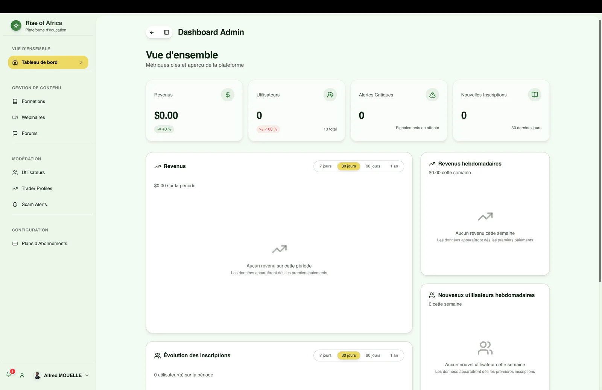
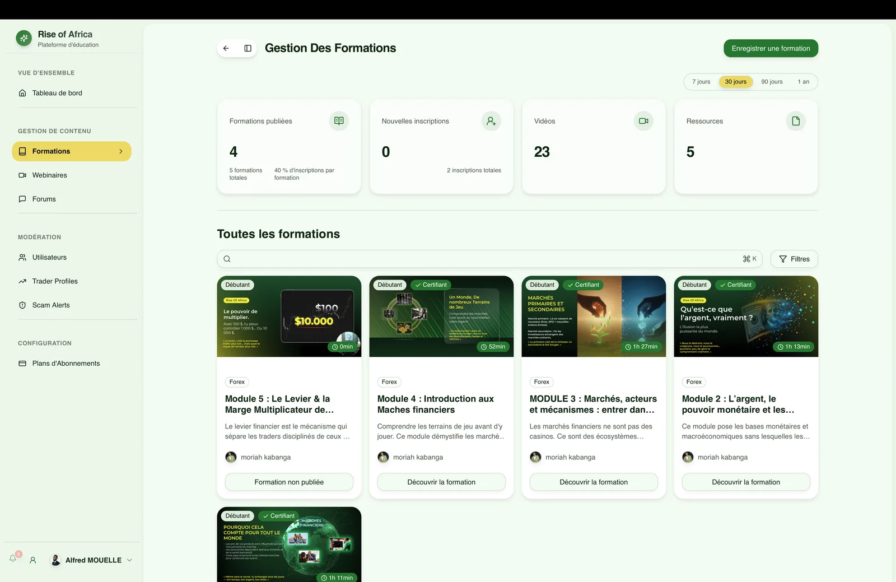

# Rise of Africa — the e-learning platform built for trading

## The product

**Rise of Africa** is an online learning platform centered on trading and financial education. It brings together educational content, community and progress-tracking tools in one place, guiding members from their first course all the way to practice.

## Member area

The member dashboard gives a clear view of progress: courses taken, watch time, completed modules, upcoming webinars, engagement metrics and a personalized trader profile.

## Key features

- **Courses & webinars** — A catalog of module-based courses with progress tracking and scheduled webinars.
- **Member area** — Personalized dashboard, engagement metrics and trader profile.
- **Community forums** — Spaces for members to ask questions and share with one another.
- **Anti-scam system** — Scam reporting to protect the community from fraud.
- **Payments & subscriptions** — Course purchases and subscription management via Stripe.
- **Video & notifications** — Video playback for courses and webinars, plus push notifications (web-push).
- **Admin dashboard** — Full management of users, courses and content.

## Admin back-office

On the admin side, the platform offers a complete dashboard to run the operation: user tracking, global statistics and course-catalog management.

## Tech stack

- **Frontend & Backend**: Next.js (App Router) and TypeScript.
- **API**: tRPC, for end-to-end type-safe client-server communication.
- **Database**: PostgreSQL via Drizzle ORM.
- **Authentication**: better-auth.
- **Payments**: Stripe.
- **Media storage**: AWS S3, with video playback via react-player.
- **Notifications**: web-push and transactional emails (Resend + React Email).
- **Background jobs**: Inngest.
- **UI**: Tailwind CSS and Radix UI.
- **Testing**: Playwright (E2E) and Vitest.

## My role

I worked as a Full Stack developer across the whole platform: member area, admin back-office, forums and reporting system, Stripe payments and video streaming integration, with particular care for a consistent experience between the member and admin spaces.
