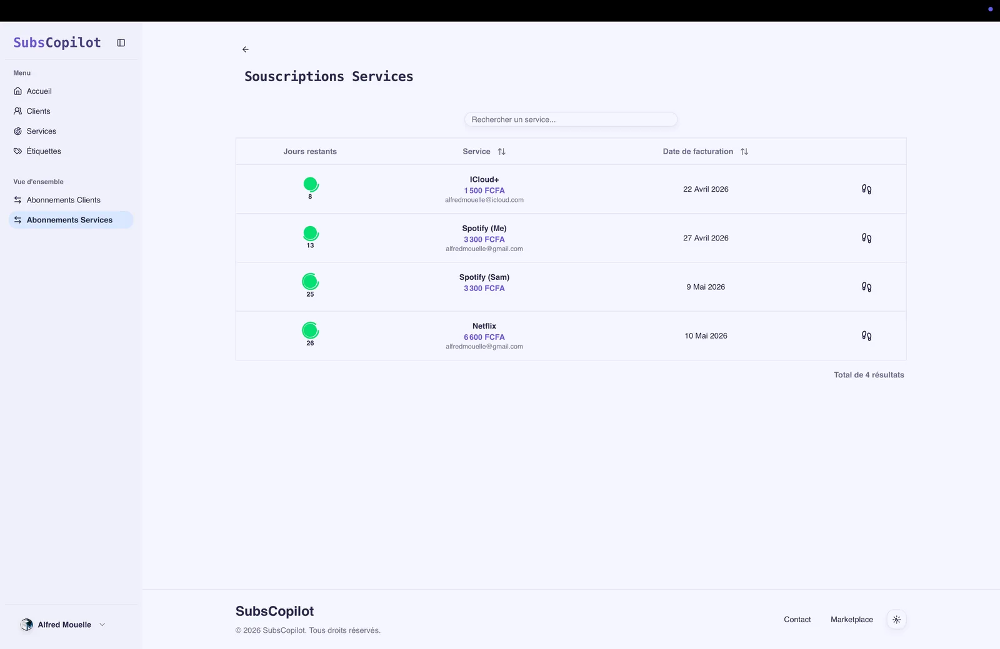
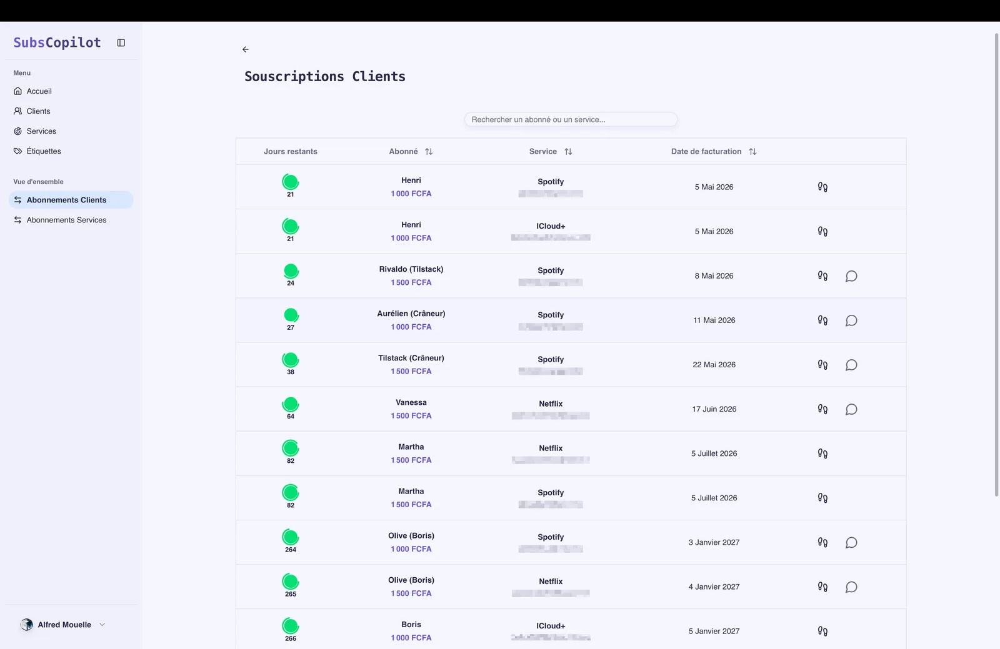
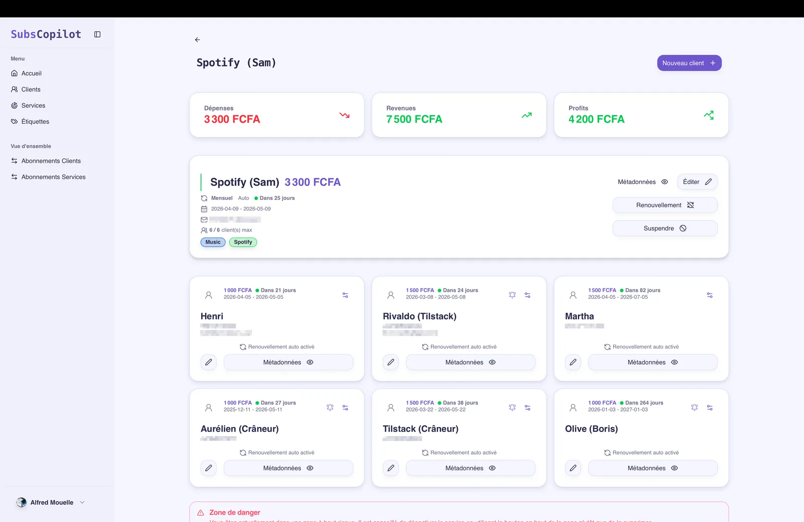

# SubsCopilot — simplify the way you manage subscriptions

## The product

**SubsCopilot** is a SaaS platform that centralizes, tracks and automates subscription management. Whether you manage your own subscriptions or those of several clients, the tool gives you a unified view and never lets a renewal slip by.

## Key features

- **Centralized management** — Every subscription and tracked service from a single dashboard.
- **Smart reminders** — Automated **email** and **WhatsApp** notifications ahead of each due date.
- **Multi-organization** — Manage multiple organizations, services and clients from one account.
- **Customizable workflows** — Notification templates that adapt to each service's needs.
- **Due-date tracking** — Days-remaining countdowns and billing dates at a glance.

## Clients & services management

SubsCopilot separates **client subscriptions** from **service subscriptions**, which makes it relevant both for personal use and for a small business managing subscriptions on behalf of its clients.

## Model & pricing

- **Free** — Up to 10 services and 2 subscribers per service.
- **Pro** — From 10,000 XAF, with unlimited organizations, services and subscribers.

## Tech stack

- **Frontend & Backend**: Next.js (App Router) and TypeScript.
- **API**: tRPC, for end-to-end type-safe client-server communication.
- **Database**: PostgreSQL (Neon serverless) via Prisma.
- **Authentication**: better-auth.
- **Scheduled reminders**: Inngest, to orchestrate notifications.
- **Notification channels**: Twilio (WhatsApp) and Resend + React Email (email).
- **UI**: Tailwind CSS and Radix UI.

## My role

A personal project I design and build end to end: architecture, type-safe tRPC API, data modeling, scheduled-reminder orchestration (Inngest), notification-channel integration (email via Resend, WhatsApp via Twilio), and the interface.
