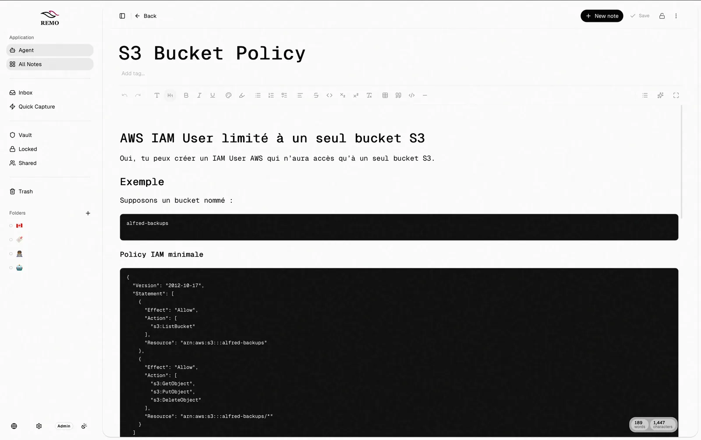
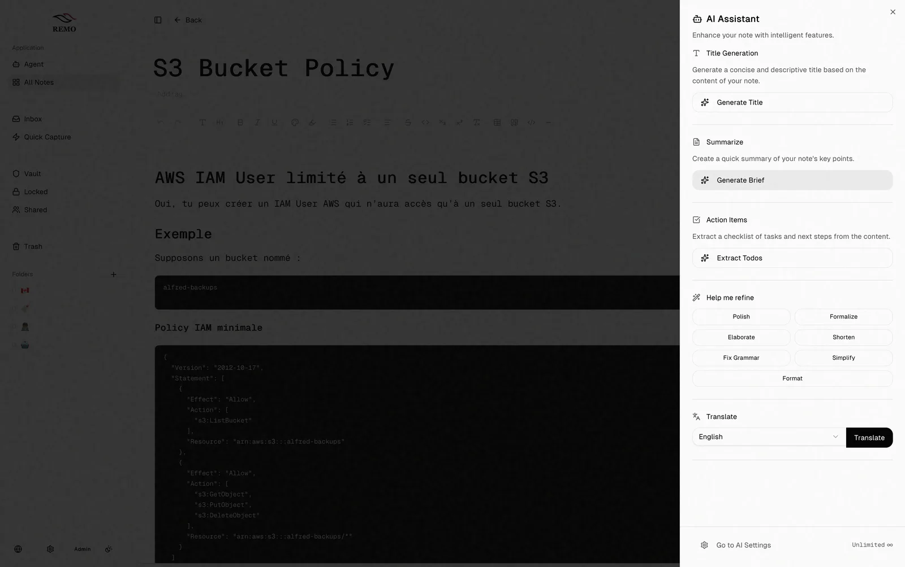
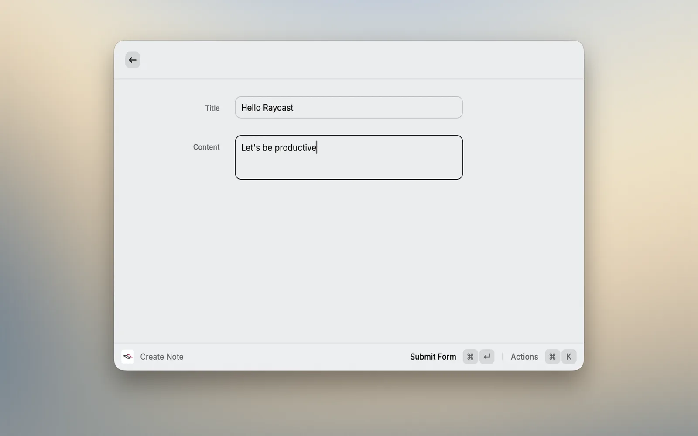
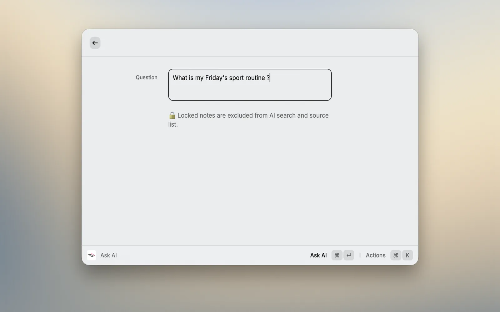

# Remo — la prise de notes pensée autour de votre workflow

## Le produit

**Remo** est une application de prise de notes que je conçois et développe en public. L'idée de départ est simple : la plupart des outils de notes sont soit trop légers pour vraiment travailler, soit trop lourds et lents. Remo cherche le juste milieu — **simple par défaut, puissant quand il le faut**.

L'objectif tient en trois temps : **capturer** une idée en quelques secondes, **structurer** ses notes sans friction, puis **passer à l'action** grâce à des workflows IA ancrés dans son propre contenu.

## Fonctionnalités clés

- **Capture instantanée** — Création d'une note en moins de trois secondes, directement depuis l'extension Raycast, sans quitter son flux de travail.
- **Assistant contextuel** — Résumé, reformulation, traduction et extraction de tâches via une couche IA multi-fournisseurs.
- **Coffre-fort & chiffrement** — Protection des notes sensibles avec verrouillage et chiffrement de bout en bout optionnel.
- **Synchronisation temps réel** — Notes synchronisées instantanément sur tous les appareils via Convex.
- **Portabilité des données** — Import/export libres et partage de notes par liens sécurisés. Les données appartiennent à l'utilisateur.
- **Historique** — Snapshots et restauration pour revenir en arrière à tout moment.

## L'IA, ancrée dans vos notes

L'assistant de Remo ne se contente pas de générer du texte : il s'appuie sur le contenu réel de l'utilisateur pour répondre à des questions, résumer, ou extraire des actions concrètes. La couche IA est abstraite derrière une interface multi-fournisseurs (Anthropic, OpenAI, Gemini, Ollama), ce qui permet de basculer de modèle sans réécrire la logique métier.

## Capture & IA depuis Raycast

L'extension Raycast est ce qui rend Remo réellement portable : créer une note, lancer une recherche ou interroger l'assistant IA sans jamais quitter son flux de travail.

## Architecture & stack technique

Remo est un **monorepo Turborepo + pnpm** réunissant plusieurs surfaces autour d'un même backend :

- **Frontend** : TanStack Start (React 19), Shadcn UI et Tailwind CSS.
- **Backend & base de données** : Convex (serverless, temps réel).
- **Authentification** : Clerk.
- **IA** : Vercel AI SDK, en abstraction multi-fournisseurs.
- **Éditeur** : Tiptap.
- **Surfaces** : application web (avec support PWA hors-ligne), application desktop Electron (macOS / Windows) et extension Raycast.

## Mon rôle

Je porte Remo de bout en bout : conception produit, architecture du monorepo, développement du web, du desktop et de l'extension Raycast, ainsi que la couche IA partagée. La roadmap est ouverte et le produit est construit publiquement, en priorisant les fonctionnalités à partir des retours réels des utilisateurs.
