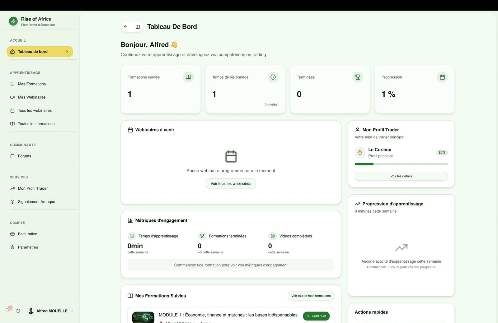
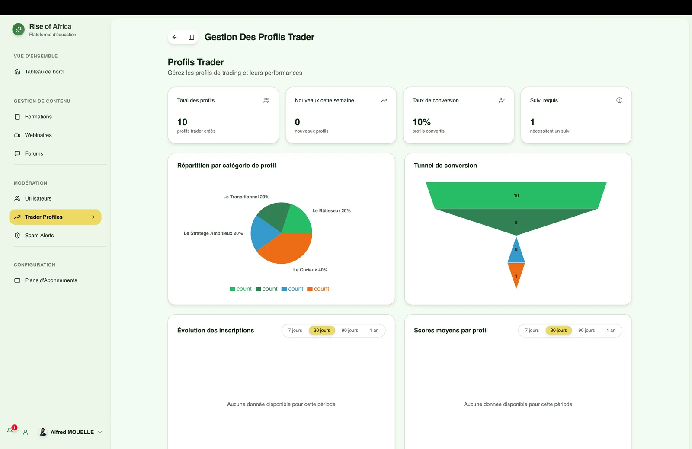
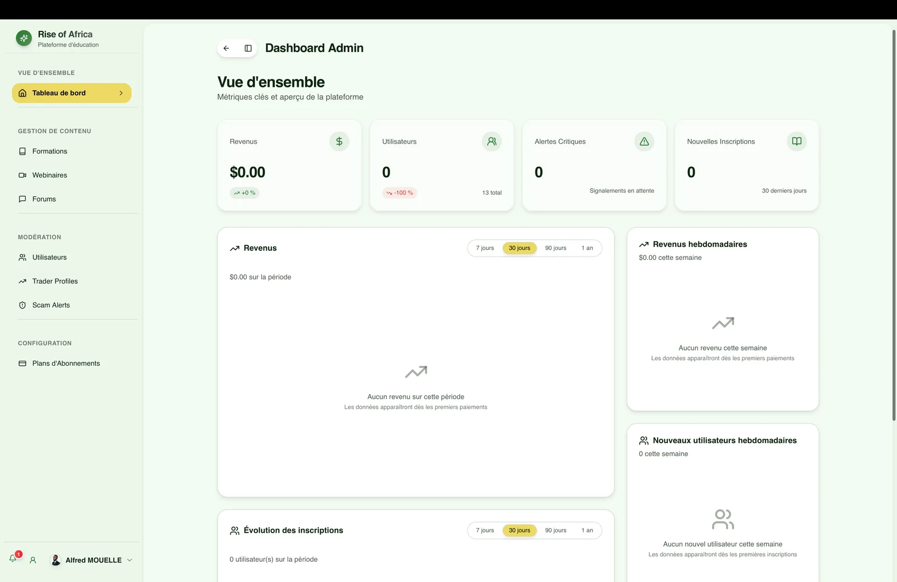
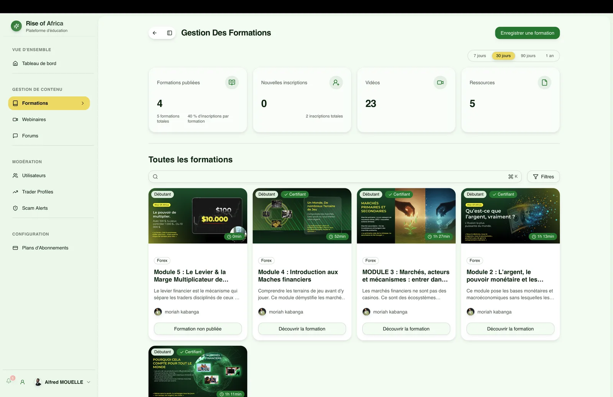

# Rise of Africa : plateforme e-learning dédiée au trading

## Le produit

**Rise of Africa** est une plateforme d'apprentissage en ligne consacrée au trading et à l'éducation financière. Elle rassemble dans un espace unique les modules pédagogiques, les échanges communautaires et le suivi de progression des apprenants.

## Espace membre

Le tableau de bord permet à chaque membre de suivre les modules visionnés, le temps d'apprentissage cumulé, les prochains webinaires en direct et ses indicateurs de progression sur un profil de trader personnalisé.

## Fonctionnalités clés

- **Formations vidéo & webinaires** : parcours d'apprentissage par chapitres avec suivi précis de la progression et sessions live planifiées.
- **Profil de trader** : espace personnel affichant les statistiques de visionnage et les étapes validées.
- **Forums communautaires** : espaces de discussion thématiques entre apprenants et formateurs.
- **Signalement anti-arnaque** : module de signalement pour alerter la communauté contre les fraudes récurrentes du secteur.
- **Paiements & abonnements** : intégration Stripe pour l'achat de modules à l'unité et la gestion des abonnements mensuels.
- **Diffusion vidéo** : stockage sécurisé sur AWS S3 avec lecteur adaptatif et notifications web-push lors des nouveautés.
- **Back-office administrateur** : gestion des cohortes d'étudiants, publication de vidéos et suivi financier.

## Back-office administrateur

L'équipe d'administration gère le catalogue de formations, suit les métriques d'engagement des membres et traite les demandes d'assistance depuis un tableau de bord dédié.

## Stack technique

- **Framework applicatif** : Next.js App Router avec TypeScript.
- **Couche API** : tRPC pour des appels client-serveur strictement typés.
- **Base de données** : PostgreSQL avec Drizzle ORM.
- **Authentification** : better-auth.
- **Paiements** : Stripe (Checkout et Webhooks).
- **Médias & stockage** : AWS S3 pour l'hébergement vidéo.
- **Notifications** : Web Push API et emails transactionnels via Resend et React Email.
- **Tâches asynchrones** : Inngest pour l'orchestration des jobs en arrière-plan.
- **Tests** : Vitest pour la logique métier et Playwright pour les scénarios E2E.

## Mon rôle

En tant que développeur full-stack sur ce projet, j'ai développé l'espace membre et le back-office d'administration, modélisé la base de données avec Drizzle, conçu les procédures tRPC et intégré la facturation Stripe ainsi que le traitement vidéo.
