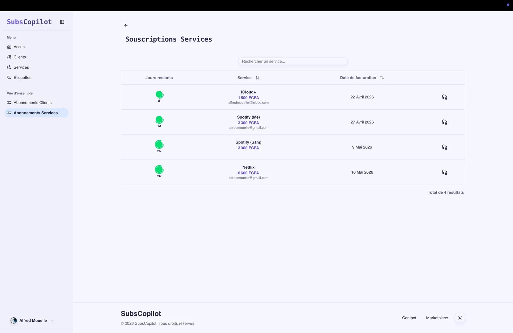
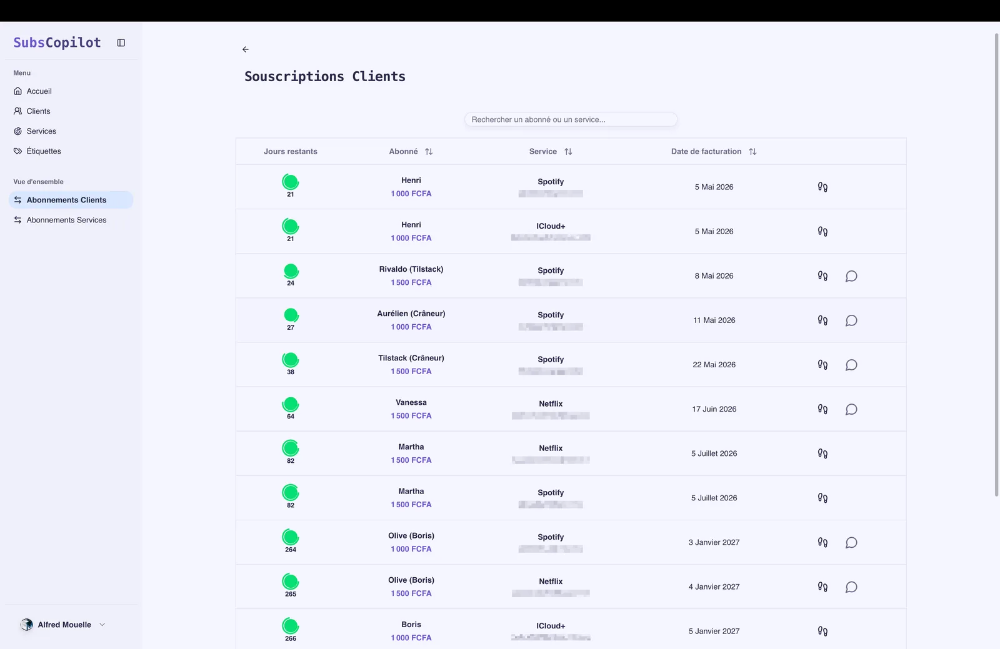
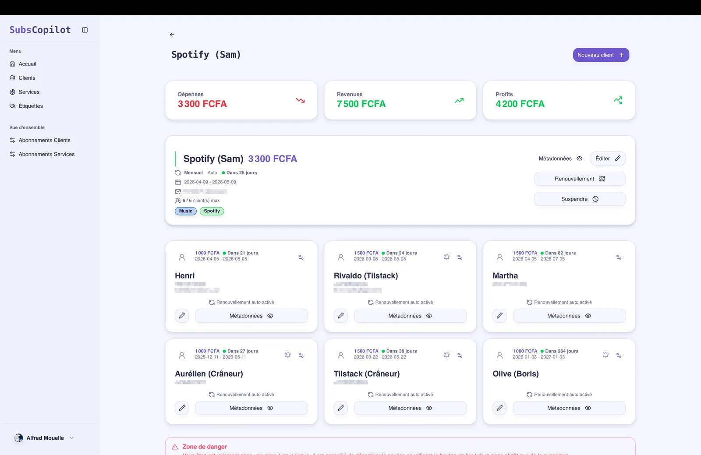

# SubsCopilot : suivi des abonnements et rappels WhatsApp / email

## Le produit

**SubsCopilot** est une application web conçue pour centraliser le suivi des abonnements récurrents et automatiser les rappels de renouvellement. L'outil permet aux indépendants et aux agences de piloter leurs dépenses et les échéances de leurs clients sans manquer une date de facturation.

## Fonctionnalités clés

- **Tableau de bord centralisé** : visualisation globale des services actifs, des coûts associés et des prochaines échéances.
- **Rappels multicanaux** : notifications automatiques envoyées par email (Resend) et WhatsApp (Twilio) avant chaque date limite.
- **Espaces multi-organisations** : gestion cloisonnée des clients, des équipes et des services depuis un compte unique.
- **Modèles de messages personnalisables** : gabarits de notification adaptés au contexte de chaque client.
- **Suivi des échéances en temps réel** : décompte des jours restants et calendrier des facturations à venir.

## Gestion distincte des services et des clients

SubsCopilot sépare le suivi des outils internes de l'entreprise des abonnements refacturés à des clients tiers, ce qui le rend utile aussi bien pour gérer ses propres coûts logiciels que pour suivre les forfaits de ses clients.

## Grille tarifaire

- **Gratuit** : jusqu'à 10 services et 2 abonnés par service.
- **Pro** : à partir de 10 000 XAF avec organisations, services et abonnés illimités.

## Stack technique

- **Frontend & backend** : Next.js App Router avec TypeScript.
- **API** : tRPC pour des échanges typés de bout en bout.
- **Base de données** : PostgreSQL hébergé sur Neon serverless avec Prisma.
- **Authentification** : better-auth.
- **Planification des tâches** : Inngest pour l'orchestration des jobs de rappel récurrents.
- **Canaux de messagerie** : Twilio WhatsApp API et Resend avec React Email.
- **Composants d'interface** : Tailwind CSS et Radix UI.

## Mon rôle

J'ai conçu et développé SubsCopilot en tant que projet personnel, de l'architecture logicielle à la modélisation de données, en passant par les jobs asynchrones Inngest et l'interface utilisateur.
