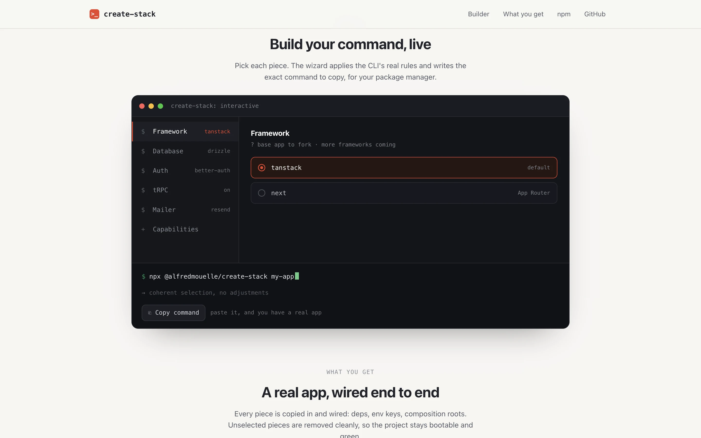

# create-stack : composez votre stack, shippez une vraie app

## Le produit

**create-stack** est une CLI de scaffolding publiée sur npm (`@alfredmouelle/create-stack`) qui génère un starter full-stack prêt à l'emploi. Elle est pensée comme un bootstrapper **agnostique du framework** : Next.js (App Router) et TanStack Start sont supportés aujourd'hui, et d'autres frameworks sont sur la roadmap. Contrairement aux générateurs classiques à base de templates à trous, elle adopte une approche « fork puis strip » : elle copie une **vraie application de base entièrement câblée**, puis retire proprement tout ce que vous n'avez pas sélectionné. Le résultat build, passe le typecheck et démarre dès le premier commit, sans devinette.

## Fonctionnalités clés

- **Agnostique du framework** : Next.js (App Router) et TanStack Start disponibles aujourd'hui, d'autres frameworks à venir. Chacun est une vraie app avec SSR, routing, Tailwind v4 + shadcn et theme toggle.
- **Wizard interactif** : un assistant en ligne de commande (`@clack/prompts`) guide chaque choix ; passer un flag bascule automatiquement en mode non-interactif pour l'automatisation.
- **Base de données au choix** : Drizzle (Postgres avec adapter, schéma, seed et pagination keyset), Prisma 7, Convex temps réel, ou aucune pour une vitrine.
- **Auth & API** : better-auth (email/mot de passe, vérification, Google OAuth) ou Clerk hébergé, avec tRPC v11 typé de bout en bout.
- **Capabilities opt-in** : storage, cache, jobs, logger, analytics et error-tracking, chacun derrière un port (architecture ports & adapters) pour changer de provider via une seule variable d'environnement.
- **Green from commit one** : Biome strict, `env.ts` typé, Dockerfile, git hooks, workflow CI GitHub Actions généré, `.env` créé, le tout vérifié par typecheck + Biome avant le premier commit.

## Ingénierie & qualité

- **Testée end-to-end** : suite Vitest complète, dont un smoke test qui génère un vrai projet puis lance install, typecheck et lint dessus.
- **CI en matrice** : chaque PR est vérifiée sur les deux frameworks supportés (Next.js et TanStack Start).
- **Publication sécurisée** : npm Trusted Publishing (OIDC), sans token, avec provenance signée.
- **Empreinte minimale** : CLI en ESM pur, une seule dépendance runtime (`@clack/prompts`), zéro étape de build.

## Stack technique

- **CLI** : Node.js (≥ 22), ESM, parsing d'arguments maison, `@clack/prompts` pour l'interactif.
- **Distribution** : monorepo pnpm + Turborepo, bundle self-contained au `prepack`, publication via GitHub Actions + OIDC.
- **App générée** : Next.js / TanStack Start (et bientôt d'autres), React 19, tRPC v11, Drizzle / Prisma 7 / Convex, better-auth / Clerk, Tailwind v4 + shadcn, env typé (`@t3-oss/env-core` + valibot).
- **Qualité** : Vitest, smoke tests, Biome v2 strict, CI + publish GitHub Actions.

## Mon rôle

Projet personnel open source (MIT) que je conçois et développe de bout en bout : l'architecture « fork & strip » agnostique du framework, le moteur de composition (auth, database, mailer, capabilities), le wizard interactif, la suite de tests et smoke tests, la CI/CD avec trusted publishing, ainsi que le site vitrine et son builder de commande interactif. Inspiré de create-t3-app.
